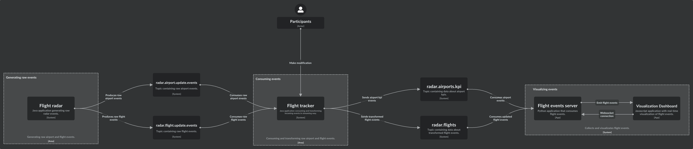

# Barkod data engineering task

The Barkod task involves collecting and analyzing real-time flight data using a streaming platform. The goal of this task is to create a system that can process large amounts of flight data in real-time and provide useful insights, such as flight status, delays, etc. The system must be able to handle streaming data, which requires a robust and scalable architecture. Barkod system architecture is shown on *Diagram 1*.  

<figure>
  
  <figcaption align = "center"><i>Diagram.1: Barkod system architecture</i></figcaption>
</figure>

## System description

In the following task is described thorough concepts of system entities, components and participant assignments.  

### System entities

Entities are represented with Avro schema and encoded with Avro specific binary protocol. Entities are registered within Confluent schema registry.  

Example of airport update record: [AvroUpdateEvent](flight-radar/src/main/avro/AirportUpdateEvent.avsc).  
Example of flight update record: [FlightUpdateEvent](flight-radar/src/main/avro/FlightUpdateEvent.avsc).  

### System components

System is composed of services (applications) and external components connecting these system services.  

#### Applications

- flight-radar-application 
  - Generates new AirportUpdateEvent and FlightUpdateEvent
  - Publishes update events to the Kafka topics with Avro serialization
  - Output topics `radar.airport.update.events` and `radar.flight.update.events` contain Airport and Flight update events
- flight-tracker application 
  - Consumes topics `radar.airport.update.events` and `radar.flight.update.events`
  - Performs transformations on input events
  - Publishes transformation results to output topics `radar.airports.kpi` and `radar.flights`
- flight-server and visualization
  - Consumes `radar.airports.kpi` and `radar.flights` topics
  - Sends updated events for visualization

#### External components

- Apache Kafka
  - Cluster with three nodes 
  - Multiple topics with Avro encoded messages 
  - Accompanied by schema registry 

### Assignments

The following section contains list of task required from participants.  
Overall task is to build stream topology which reads input topics and performs following transformations.  

#### Transformation of Flight update events

Flight update events read from topic radar.flight.update.events should be transformed in the following way.  
Task with [] ahead of description specifies field name and field type respectively.

- Define Avro schema for Flight entity that is the results of transformations listed below.
- [to, string] - Extract start place from destination column.
- [from, string] - Extract end place from destination column.
- [departureTimestamp, long] - Rename field STD to departureTimestamp.
- [arrivalTimestamp, long] - Rename field STA to arrivalTimestamp.
- [duration, long] - Calculate duration of a flight in minutes.
- [departureDatetime, string] - Transform STD to ISO 8601 format using the timezone of destination defined in the timezones column of input event.
- [arrivalDatetime, string] - Transform STA timestamp to ISO 8601 format using the timezone of arrival destination defined in the timezones column of input event.
- [departureAirportCode, string] - Extract departure airport code from destination column of input event.
- [arrivalAirportCode, string] - Extract arrival airport code from destination column of input event.

The rest of the fields are preserved except for the destination, STA, STD and timezones fields.
Transformed flights should be published to the output topic `radar.flights`.
Canceled flights should be ignored.

#### Calculating Key Performance Indicators (KPI) for airport

Using airport update events and transformed flight events calculate the following KPIs using starting destination as the point of view.

1. Number of departures in the last 5 minutes (hop by 1 minute). Exclude flights with statuses LATE and CANCELED.
2. Number of canceled flights in the last 5 minutes (hop by 1 minute).
3. Minimal flight duration.
   1. Consider only flights with status LANDED 
4. Last departure timestamp.
5. Five minutes windows should be calculated based on the event timestamp (departure timestamp). 
6. Calculated aggregation should be joined with airport input topic (`radar.airport.update.events`). 
7. The result of join should be published to `radar.airports.kpi` topic.

Events outside of 5 minute windows period should be ignored.  
The results of these tasks should be two output topics with key, value: `radar.airports.kpi` (airportCode, AirportKpi) and `radar.flights` (flightId, Flight)  
Schema for [AirportKpi](flight-tracker/src/main/avro/AirportKpi.avsc) event is already created for you.  
*Additional task*: Reduce number of output messages on topic `radar.airports.kpi`. Wait for amount of time (3 minutes) before emitting the aggregation result.  

## Starting application

The whole architecture can be started with command `docker-compose -f infrastructure/docker-compose.yml up -d` from the root directory.  
This is going to start Kafka cluster, create topics if they don't exist, schema registry, flight-server, flight-radar and conduktor.  
Conduktor can be used while developing to inspect cluster, topic messages etc. Conduktor is started on localhost:8080.  

Flight-tracker application can be started via IDE or with command `mvn compile exec:java -Dexec.mainClass=flights.Runner`.

